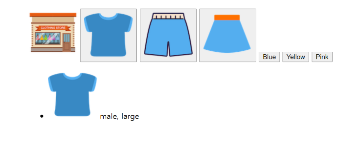
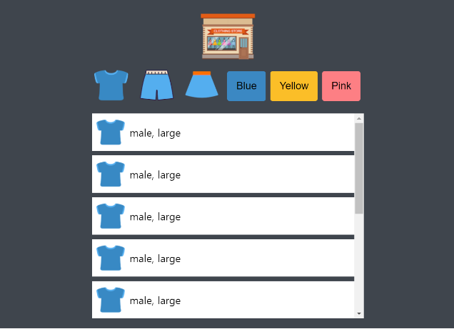
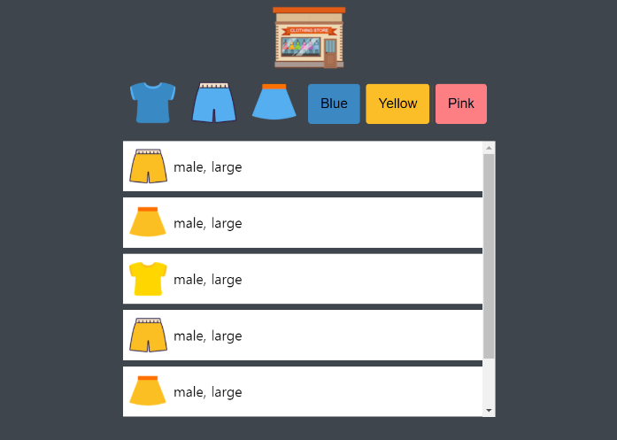
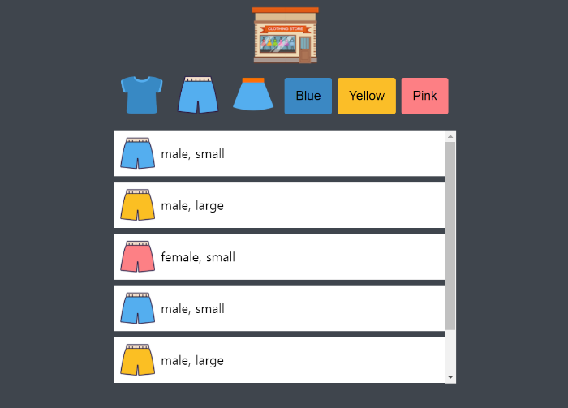

# 미니 쇼핑몰 게임 만들기

### 최종 완성본 : https://whitejh.github.io/mini-shopping/.  

### 요약  

자바스크립트를 통해 JSON 데이터를 받아와 아이템 리스트를 동적으로 표시해주고, 
색깔과 옷 종류에 따라 필터링 할 수 있는 간단한 미니 게임 
object 데이터 다루기, 배열 관리 API와 Callback 함수의 개념을 더 다질 수 있었다

## 1. HTML 마크업

- HTML까지 완성 후 페이지
  

## 2. CSS 꾸미기

- CSS까지 완성 후 페이지
  

## 3. JSON 데이터 저장

- 동적인 페이지 구성할 때, HTML 안에 데이터와 HTML 요소(UI 적 요소)가 섞여 있는 것은 좋지 않다
- 자바스크립트는 어플리케이션의 비즈니스 로직을 담당 (코드)
- 데이터는 보통 자바스크립트가 아닌 곳에 보관 ex) backend, data file
- 이 프로젝트는 백엔드가 없어서 data.json 파일을 이용하고 동적으로 요소를 추가하여 데이터 보관
- JSON = JavaScript Object Notation (Object와 유사)
- Object는 key : value로 구성된다

  data.json 파일 안에는 items라는 배열이 들어 있고, 그 안에는 여러 item들이 들어있다 
  data.json을 main.js에 동적으로 연결해줘야 적용된다

## JS(JSON 동적 fetch 이후)까지 만들고 완성한 페이지

### 색 구분

### 옷 구분

